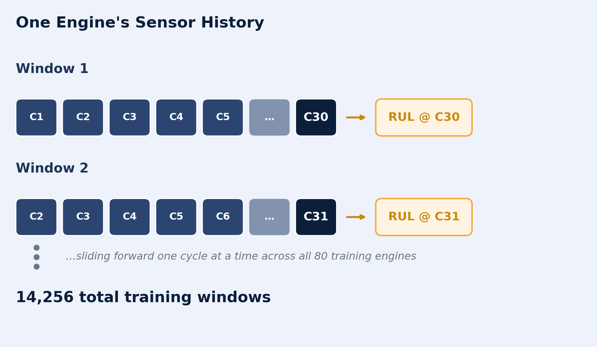

# Remaining Useful Life (RUL) Prediction for Aircraft Turbofan Engines Using LSTM Deep Learning
 
## 🎯 Project Overview
 
Unexpected aircraft engine failures can lead to costly maintenance, operational downtime, and significant safety risks. This project develops a predictive maintenance solution that estimates the **Remaining Useful Life (RUL)**  of aircraft engines from multivariate sensor time-series data. Using a **PyTorch LSTM deep learning model**, the system learns temporal degradation patterns from engine sensor histories and predicts how many operating cycles remain before failure.

The final model achieved a **Test RMSE of 14.16** operating cycles on 100 unseen aircraft engines, demonstrating that temporal sensor patterns can be used to estimate engine health and support proactive maintenance decisions.

## 📊 Dataset & Sources

- **Source:** [NASA C-MAPSS Jet Engine Simulated Data — FD001 subset](https://data.nasa.gov/dataset/cmapss-jet-engine-simulated-data)
- **Size:** 100 training engines (20,631 cycles total), each run from a healthy state to failure; 100 test engines (13,096 cycles), each truncated at a random point before failure, with a separate file giving the true RUL at that cutoff.
- **Key features:** engine unit, operating cycle, 3 operating settings, and 21 sensor channels (temperature, pressure, rotor speed, etc.) recorded once per cycle. All engines run under a single operating condition (sea level) and a single fault mode.

<b>Full sensor data dictionary (click to expand)</b>

<table>
<tr><th>Sensor</th><th>Short Code</th><th>Description</th><th>Unit</th><th>Used in Final Model?</th></tr>
<tr><td>sensor_1</td><td>T2</td><td>Total Temperature at Fan Inlet</td><td>°R</td><td>Dropped — constant</td></tr>
<tr><td>sensor_2</td><td>T24</td><td>Total Temperature at LPC Outlet</td><td>°R</td><td>✅</td></tr>
<tr><td>sensor_3</td><td>T30</td><td>Total Temperature at HPC Outlet</td><td>°R</td><td>✅</td></tr>
<tr><td>sensor_4</td><td>T50</td><td>Total Temperature at LPT Outlet</td><td>°R</td><td>✅</td></tr>
<tr><td>sensor_5</td><td>P2</td><td>Pressure at Fan Inlet</td><td>psia</td><td>Dropped — constant</td></tr>
<tr><td>sensor_6</td><td>P15</td><td>Total Pressure in Bypass-Duct</td><td>psia</td><td>Dropped — near-zero correlation with RUL</td></tr>
<tr><td>sensor_7</td><td>P30</td><td>Total Pressure at HPC Outlet</td><td>psia</td><td>✅</td></tr>
<tr><td>sensor_8</td><td>Nf</td><td>Physical Fan Speed</td><td>rpm</td><td>✅</td></tr>
<tr><td>sensor_9</td><td>Nc</td><td>Physical Core Speed</td><td>rpm</td><td>✅</td></tr>
<tr><td>sensor_10</td><td>epr</td><td>Engine Pressure Ratio</td><td>—</td><td>Dropped — constant</td></tr>
<tr><td>sensor_11</td><td>Ps30</td><td>Static Pressure at HPC Outlet</td><td>psia</td><td>✅</td></tr>
<tr><td>sensor_12</td><td>phi</td><td>Ratio of Fuel Flow to Ps30</td><td>pps/psi</td><td>✅</td></tr>
<tr><td>sensor_13</td><td>NRf</td><td>Corrected Fan Speed</td><td>rpm</td><td>✅</td></tr>
<tr><td>sensor_14</td><td>NRc</td><td>Corrected Core Speed</td><td>rpm</td><td>✅</td></tr>
<tr><td>sensor_15</td><td>BPR</td><td>Bypass Ratio</td><td>—</td><td>✅</td></tr>
<tr><td>sensor_16</td><td>farB</td><td>Burner Fuel-Air Ratio</td><td>—</td><td>Dropped — constant</td></tr>
<tr><td>sensor_17</td><td>htBleed</td><td>Bleed Enthalpy</td><td>—</td><td>✅</td></tr>
<tr><td>sensor_18</td><td>Nf_dmd</td><td>Demanded Fan Speed</td><td>rpm</td><td>Dropped — constant</td></tr>
<tr><td>sensor_19</td><td>PCNfR_dmd</td><td>Demanded Corrected Fan Speed</td><td>rpm</td><td>Dropped — constant</td></tr>
<tr><td>sensor_20</td><td>W31</td><td>HPT Coolant Bleed</td><td>lbm/s</td><td>✅</td></tr>
<tr><td>sensor_21</td><td>W32</td><td>LPT Coolant Bleed</td><td>lbm/s</td><td>✅</td></tr>
</table>
Plus 3 operating settings (<code>op_setting_1–3</code>) — only <code>op_setting_3</code> is constant (dropped); <code>op_setting_1</code>/<code>op_setting_2</code> were dropped later for near-zero correlation with RUL. <b>14 features</b> (14 of the 21 sensors above, no operating settings) remain in the final model input, each window covering 30 cycles.
 

- **Preprocessing notes:**
  - No missing values (simulated dataset), so no imputation was needed.
  - **7 constant/dead sensors** — `op_setting_3`, `sensor_1`, `sensor_5`, `sensor_10`, `sensor_16`, `sensor_18`, `sensor_19` — and **3 near-zero-correlation features** (`sensor_6`, `op_setting_1`, `op_setting_2`) were dropped, leaving **14 usable features**.
  - `sensor_9` and `sensor_14` are heavily outlier-prone, so features were scaled with **`RobustScaler`** (median/IQR-based) instead of a standard scaler.
  - The RUL target was **capped at 125 cycles** (piecewise-linear target) — EDA showed sensor readings stay essentially flat while an engine has more than ~125 cycles left, so capping lets the model focus on the region where degradation is actually visible.
  - **Sliding windows:** the LSTM needs to see *change* over time, not a single cycle, so each engine's history was cut into overlapping 30-cycle windows, sliding forward one cycle at a time. Each window's target (RUL) is taken at that window's **last cycle** — i.e. "given the last 30 cycles of readings, what is the RUL right now?" Doing this across all 80 training-split engines produced **14,256 training windows** (`X_train` shape `(14256, 30, 14)`, `y_train` shape `(14256,)`).
    
    
    
    *How the sliding window works: a 30-cycle window slides forward one cycle at a time across an engine's history, with the RUL target read at each window's last cycle. Repeated across all engines, this is what turns raw per-cycle rows into 14,256 training sequences.*
  - **Batching (PyTorch `DataLoader`):** the 14,256 windows are then grouped into random, **shuffled** batches of **64** before being fed to the LSTM — `X_batch` shape `torch.Size([64, 30, 14])`, `y_batch` shape `torch.Size([64])`, where **64** is the number of windows in that batch, **30** is the number of cycles per window, and **14** is the number of sensor/setting features per cycle.

     Training on one window at a time would be slow and give the model a noisy, unstable gradient signal; batching 64 windows together lets PyTorch process them as a single tensor operation (much faster, especially on a GPU) and averages the gradient over 64 examples per update, which makes training smoother and more stable.
     The batches are shuffled every epoch (`shuffle=True`) rather than fed in the fixed engine-by-engine order they were created in — this stops the model from learning a spurious order/position pattern and keeps each batch a random, representative mix of engines and degradation stages.
 

## 🚀 Key Findings & Results
 
- **Test RMSE: 14.16 cycles** (MSE 200.57) on 100 held-out engines never used in training or hyperparameter tuning — predictions are typically off by about 14 cycles from the true remaining life.
- The model is **most accurate when an engine is close to failure** (true RUL under ~60 cycles), which is exactly the regime where a maintenance decision actually matters. The largest errors occur in the mid-range (RUL ≈ 60–120), where degradation signal is still gradual and harder to pinpoint.
- Sensor correlation analysis identified **`sensor_11`, `sensor_4`, `sensor_12`, and `sensor_7`** as the strongest degradation indicators (correlation with RUL between 0.66 and 0.70).
- The winning architecture — a single-layer LSTM with `hidden_size=64` and learning rate `0.001` — was chosen via grid search.

<table>
<tr><th></th><th>hidden_size</th><th>num_layers</th><th>learning_rate</th><th>VAL_RMSE</th></tr>
<tr><td>0</td><td>64</td><td>1</td><td>0.0010</td><td><b>13.38</b></td></tr>
<tr><td>1</td><td>128</td><td>1</td><td>0.0010</td><td>15.57</td></tr>
<tr><td>2</td><td>64</td><td>1</td><td>0.0005</td><td>16.23</td></tr>
<tr><td>3</td><td>32</td><td>1</td><td>0.0010</td><td>18.04</td></tr>
<tr><td>4</td><td>32</td><td>1</td><td>0.0005</td><td>35.77</td></tr>
</table>

- **Business impact:** an average error of roughly 14 cycles is a tight enough margin to flag an engine for maintenance well before it becomes an unplanned failure, rather than relying on fixed-interval servicing.
